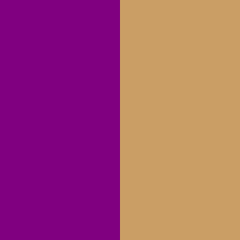

# Artiquiz

ArtiQuiz is a fun, exciting, Art-based quiz game. The ArtiQuiz website's main goal is to provide the user with a pleasurable experience,
one that's memorable and has great replay value. ArtiQuiz is also intended to teach and educate users. It is hoped that people will walk away feeling
like they've learnt something. ArtiQuiz is aimed at both adults and children alike.

The idea for ArtiQuiz first originated from a group of friends gathering together every weekend to compete in a quiz night, hosted over [Zoom](https://zoom.us/),
during the Covid-19 lockdown. Each weekend, someone would create their own quiz, and each friend would battle it out to try and win the chance to host the next quiz.
ArtiQuiz was created with this in mind; for friends and family to gather together and have fun during tough times.

---

## :books: **TABLE OF CONTENTS**

1. [Live Demo](#live-demo)  

2. [UX](#ux)
    * [User Stories](#stories)
    * [Strategy](#strategy)
    * [Scope](#scope)
    * [Structure](#structure)
    * [Skeleton](#skeleton)
        * [Sketches](#sketches)
        * [Wireframes](#wireframes)
        * [Mockups](#mockups)
    * [Surface](#surface)

3. [Existing Features](#existing)
    * [Navigation](#navigation)
    * [Home](#home)
    * [Questions](#questions)
    * [Completed](#completed)
    * [Leaderboard](#leaderboard)
    * [Other Features](#other-feat)

4. [Features left to Implement](#features-left)

5. [Technologies](#technologies)

6. [Testing](#testing)

7. [Deployment](#deployment)
    * [Configure Github Pages](#pages)
    * [Cloning Repository](#cloning)

8. [Credits](#credits)
    * [Content](#content)
    * [Media](#media)
    * [Acknowledgements](#thanks)

---

## :computer: **LIVE DEMO** 

Please feel free to delve into a demo of ArtiQuiz's website.

You can live demo ArtiQuiz's website here: 

## :sparkles: **UX** 

The user experience (UX) is what a user of a particular product experiences when using that product. A UX designer's job is thus to create a product that 
provides the best possible user experience. We're going to provide some insight into the UX process here, focusing on the important Who, What and How?

ArtiQuiz, as previously stated, is a general knowledge-based quiz game that's sole purpose is to not only provide a fun, exciting, memorable experience for
both adults and children alike, but to teach and broaden people's horizons. The hope is that people can walk away feeling like they've learnt something new. 
ArtiQuiz also has a competitive side to it, friends and family can compete to place their name at the top of ArtiQuiz's leaderboard. Do you have what it takes?
Carry on below and read some of ArtiQuiz's user stories to get a feel for what people have been saying about ArtiQuiz.

---

### **USER STORIES** 

>   Bright attractive colours are needed. My favourite artist is Andy Warhol for the pink and aquamarine pops!. - Lindsay W

>   Need an attractive logo which really captures the eye. - Diane W

>   I want to test test my Art knowledge in a fun way. - Elliot R

>   Randomly generated questions/answers are a must have! - Abi C

>   A progress bar should be included to give people a visualisation of their progress. - Laurie D

>   Definitely need a timer to be included so that players have a sense of urgency. - Lindsay W

>   Need a visual way to keep track of what question you're on and what score you have. - Heather P

>   Must have a leaderboard and a way to save scores. - Phil W

>   Easy navigation within the website is a must. Have to make it user friendly. - Becky D

---

### **STRATEGY** 

The strategy of the ArtiQuiz website is to entertain and educate users. Our long term ambition is that ArtiQuiz hopes to move into an e-commerce situation 
where the product is licenced and the product is part of an expanded range. ArtiQuiz hopes to have multiple categories ranging from movie trivia, sports, 
history, and even geography! It is expected, that within a period, a cloud based storage system will be put in place to further improve the playability and 
replay value. Another long term strategy is that we hope to offer the public the ability to add their own questions and ultimately host our own API.

---

### **SCOPE** 

The scope of ArtiQuiz is to provide a flawless user experience straight from the get-go. We want users to be highly entertained in a socially competitive
environment whilst absorbing information they may not have encountered before. Ultimately we want users to return time and time again, not only climb the
leaderboard and show off their new-found knowledge, but to learn something new every time.

---

### **STRUCTURE** 

Each page will have a ArtiQuiz logo situated at the top of the screen, whether it's in the middle, or located to the left. Each page will have an identical
footer which contains copyright information and a link to the developer's LinkedIn profile. There are four pages in total, the Home page, Questions page, 
Completed page and Leaderboard page. The home page is fairly basic and offers only what the user needs to know. It contains ArtiQuiz's main logo image, 
a few lines of text, two navigation buttons, and a footer.

On the questions page, all questions will be displayed within one HTML page which will be randomly generated by the [Open Trivia Database](https://opentdb.com/) API. 
Each question will be navigated through via JavaScript. There are ten questions in total and there are four possible answers to each question. There is a progress bar 
located directly beneath the questions which will automatically fill as each question is answered. Below this there is a question counter, a timer and a score tally. 
These will all update automatically with the use of JavaScript as the user completes each question. Towards the bottom of the pages a there will be a "Return to Home" 
button which users can click to return to the Home page. 

The Completed page has large text indicating that the quiz has been completed. There is a name field and a save button below so that users can save their scores and 
upload them to the leaderboard. There are also a number of buttons that will navigate to the different pages of the ArtiQuizz website. Finally, the leaderboard will 
have a main title. The rest of the page will Initially display bare. As users upload their scores, a table will appear and populate user's names and their scores. The
leaderboard page also contains a "Return to Home" button.

---

### **SKELETON** 

ArtiQuiz's website started on a piece of paper. Sketches were drawn out and a decent design was soon ready to leap into the digital world.
Below you shall find some images of the original sketches used to help develop this project.

#### *Sketches* 

After drawing up the sketches it was time to get them onto the screen. To do this a wireframe was created using Balsamiq Wireframes 4.
Wireframes are used to display what the creator ultimately envisions the website to look like, roughly! It acts as one of the first stepping stones
of the journey. Please find below the original Wireframes for ArtiQuiz's project.

#### *Wireframes* 

* [Home Page Wireframe](design/wireframes/ms2-wireframe-home.png)

* [Questions Page Wireframe](design/wireframes/ms2-wireframe-questions.png)

* [Completed Page Wireframe](design/wireframes/ms2-wireframe-completed.png)

* [Leaderboard Page Wireframe](design/wireframes/ms2-wireframe-leaderboard.png)

* [Mobile Home Page Wireframe](design/wireframes/ms2-mobile-wireframe-home.png)

* [Mobile Questions Page Wireframe](design/wireframes/ms2-mobile-wireframe-questions.png)

* [Mobile Completed Page Wireframe](design/wireframes/ms2-mobile-wireframe-completed.png)

* [Mobile Leaderboard Page Wireframe](design/wireframes/ms2-mobile-wireframe-leaderboard.png)

#### *Mock Ups* 

Finally with the basics down on paper and screen, it was time to start shaping things up. After wireframes, it's time to take things a little more
seriously. Enter Adobe XD. Adobe XD is a powerful piece of software designed to assist artists worldwide. More detailed designs are now progressed, 
and sketches etc.. are now a thing of the past! If you scan down slightly you will find links to ArtiQuiz's Mock-Ups. You can clearly see how the 
project has evolved.

* [Home Page Mockup](design/mockups/ms2-mockup-home.png)

* [Questions Page Mockup](design/mockups/ms2-mockup-questions.png)

* [Completed Page Mockup](design/mockups/ms2-mockup-completed.png)

* [Leaderboard Page Mockup](design/mockups/ms2-mockup-leaderboard.png)

* [Mobile Home Page Mockup](design/mockups/ms2-mobile-mockup-home.png)

* [Mobile Questions Page Mockup](design/mockups/ms2-mobile-mockup-questions.png)

* [Mobile Completed Page Mockup](design/mockups/ms2-mobile-mockup-completed.png)

* [Mobile Leaderboard Page Mockup](design/mockups/ms2-mobile-mockup-leaderboard.png)

---

### **SURFACE** 

The colour scheme chosen for this website offers fluorescent, striking colours.
There are two main colours (Purple & Gold) for this website, they're sure to impress!
This was chosen because of the colours' positive vibe and feel-good effect. Here are the chosen colours:

| **Colour Name**   | **Colour RGB Code**    
| -------------     |:-------------:| 
| Purple            |#800080
| Custom Gold       |#CA9E65

There are two more colours which are less frequent, they are the colours which appear when a user has answered a question correctly or incorrectly. 
When a user clicks an answer button, that button will briefly change colour to indicate whether or not they were successful in answering. Here are the chosen colours:

White text is used here because gold/purple text clashed negatively.

| **Colour Name**   | **Colour RGB Code**    
| -------------     |:-------------:| 
| Custom Green      |#037403
| Custom Red        |#B61E1E
| White             |#FFFFFF

The images used for ArtiQuiz's logos were chosen because they relate to the theme of the website. By this, I refer to the brain image. ArtiQuiz a thinking game
therefore users must use their brains. The bright lights located above the letters "i" within the logo represent a illuminated light bulb; this conveys thinking.

 * The font used throughout ArtiQuiz's website is Google font's Amarante - [Google Fonts' - Amarante](https://fonts.google.com/specimen/Amarante?query=Amarante).

 * If at any point a browser cannot support the Amarante font, the browser will fall back on Roboto - [Google Fonts' - Roboto](https://fonts.google.com/specimen/Roboto?query=roboto).

---

## :page_facing_up: **EXISTING FEATURES** 

### **NAVIGATION** 

* All pages feature at least one navigation button. The Home page presents the user with two navigation buttons, the "Start Game" button and the "View Leaderboard" button.
The buttons are fairly large and easily visible.

* The Questions page offers the user the ability to exit the game and return to the Home page using the "Return to Home" button. Again this button is clearly visible toward 
the bottom of the page. 

* The Completed page has slightly more options in terms of navigation. The first navigation button the user is presented with is the "Save Score" button, this button, however, 
is disabled. The "Save Score" button has been disabled to prevent users from being able to save their score without entering a name into the "Enter Name" field. Once a user has 
entered their name, the "Save Score" button becomes available to click. 

* Below the "Save Score" button there are three more buttons, "Play Again", "View Leaderboard", and "Return to Home". The "Play Again" button will instantly direct the user to 
a new game of ArtiQuizz. The "View Leaderboard" button will direct the user to view the Leaderboard page of ArtiQuiz's website. Finally, the "Return to Home" button will take 
the user back to ArtiQuiz's Home page. 

* To summarise, no matter where the user is within ArtiQuiz's website, they shouldn't have any problem navigating themselves around.
Each button has the box-shadow hover effect. This will highlight each button to make them glow gold. 

### **HOME PAGE** 

* The Home page displays a custom made ArtiQuiz logo image developed using Adobe XD. 

* The logo image features keyframes animation. The logo will increase in size from 80% to 100% over a period of four seconds.

* The Home page includes two paragraphs of text providing information to the user. This text welcomes the user and gives them slight encouragement. 

* Two buttons are found towards the bottom of the page. The first button will start the game. The second button will navigate the user to the leaderboard page.
This is mentioned in the navigation section of this document. 

* Each button has the box-shadow hover effect. Box-shadow is highly appealing to the eye and offers a better user experience. 
It essentially makes the buttons glow gold when they're interacted with.

### **QUESTIONS PAGE** 

* The Questions page displays a slightly different logo image situated to the top left-hand side of the screen. This image uses more width, rather than height, so that
little vertical screen space is taken up. Similarly, this logo image was developed using Adobe XD. 

* The first thing you should notice are the questions displayed on the Questions page. The questions themselves are displayed in a large font in gold text against a purple 
background, keeping to the theme of the ArtiQuiz website.

* Below the question, the user will be presented with four possible answers, each resembling a clickable button, much like those discovered on the Home page. When a user 
hovers their mouse over an answer button, the button will have a box-shadow effect. 

* Below the answer buttons, there is a progress bar. The progress bar is a visual interpretation of how far through the user is in their game. As a user progresses through 
the game, the progress bar will fill. There are ten questions within the ArtiQuiz game therefore the progress bar will fill ten per cent every time a question is answered. 
The progress bar has a gold border and a purple background, it fills with gold as the game progresses, keeping to the theme of the website. 

* South of the progress bar, the user is presented with three vital pieces of information.

    1. Question Counter. The question counter informs the user which question they are currently on (out of 10). This counter will increase as the game goes on.

    2. Question Timer. The timer is set to ten seconds (10), which means that each user has a maximum of ten seconds to answer any question. If a user cannot 
    answer a question in time, points will be deducted and the next question will be populated. 

    3. Score Tally. Users will be awarded ten points (10) for each correct answer but three points (3) shall be deducted for any incorrect answer. This will be automatically 
    updated with JavaScript code as the game is played. The point system is a key feature of the ArtiQuiz website. It enables key replay value and competitiveness. 
    
* When a question is answered, the button clicked will briefly change colour to either green or red, depending on whether the question was answered correctly or incorrectly. 
The text also changes to white momentarily. 

* Finally I shall mention that because questions are being loaded from an API, there can be a slight delay. Instead of users staring at a blank screen for any period, a loading 
spinner has been put in place. This loading spinner is a spinning circle which replaces all of the content of questions.html. It is gold in colour to match the theme of the website. 
To summarise, when a user is waiting for questions to load, the loading spinner appears. When questions are ready to be displayed, the loading spinner disappears and all of question.html's
content re-appears.

### **COMPLETED PAGE** 

* The completed page has the same logo as the Home page, situated in the middle of the page. This is to grab the user's attention. 

* The Completed page is presented to a user when they have answered all ten questions either correctly or incorrectly. During the game, as mentioned previously, a user accumulates 
points depending on whether they score a correct answer or an incorrect answer. Ten points (10) for correct, minus three (-3) for incorrect. This score is tallied up and presented 
to the user with a message of congratulations. 

* Below the awarded points and congratulations message, the user is presented with an "Enter Name" field, this field allows a user to enter their name so that 
they can ultimately save their awarded score onto the ArtiQuiz leaderboard. 

* Below is a "Save Score" button, as mentioned in the Navigation section of this document. Below are three navigation buttons which allow the user to navigate wherever they wish to go, 
whether it be to "Play Again", "View Leaderboard", or "Return to Home". Each of these buttons are mentioned in the navigation section of this document. Each button has the box-shadow hover effect.

### **LEADERBOARD PAGE** 
 
 * The leaderboard page logo is situated to the top left-hand side of the screen, similar to the Questions page. This image uses more width, rather than height, so that
little vertical screen space is taken up. 

* The Leaderboard page is one key element which provides the user with great replay value. The goal of ArtiQuiz's 
leaderboard is to offer the user the chance to compete against family and friends and place their name at the top of the board. 

* Each score will be mathematically decided, sorted, and displayed within an attractive table keeping to the same theme as the rest of ArtiQuiz's website. Initially, there will be no 
table to display, but as users start to complete the quiz and upload their score to local storage, the leaderboard table will begin to populate information. The information that is held 
and displayed will be the users name and score only. 

* Finally, as mentioned in the navigation section of this document, there is a "Return to Home" button located at the bottom of the 
Leaderboard page.

### **OTHER FEATURES** 

 * ArtiQuiz's website has a favicon image which displays in a user's web browser tab. The image is a small purple square with a gold coloured "Q" within it.
 This favicon image keeps to the ArtiQuiz's colour theme, and also the font used throughout the whole website. This has been added for improved UX.

---

 ## :pencil2: **FEATURES LEFT TO IMPLEMENT** 

 * Currently, there is no way for users to save their score on a device and then access their score on another device. Currently, scores are saved on local storage, therefore
 they cannot be accessed anywhere other than the device they originated from. This means that each device ArtiQuiz is played on will have a completely different leaderboard.
 In the future, cloud storage will be implemented so that players from different households/friendship groups will be able to compete against each other, rather than the current
 situation where people are limited to one device.

 * In the future there will be different categories for a user to choose from. Currently, users are limited to one category, General Knowledge. Soon, users will be able to choose
 from categories such as History, Sports, Geography, Nature, and many more.

 * Further down the line, we want to make it possible for users to submit their own questions for verification. These questions will then be uploaded into their own category for
 people to choose from.

 ---

  ## :cd: **TECHNOLOGIES USED** 

1. [HTML](https://html.spec.whatwg.org/multipage/)

    * The building blocks to everything that is code! Used to create the foundations of ArtiQuiz's website.

2. [CSS](https://www.w3.org/Style/CSS/)

    * Who's got style? Used to style ArtiQuiz's HTML code.

3. [JavaScript](https://developer.mozilla.org/en-US/docs/Web/JavaScript)

    * The brains behind it all! Timer? Check. Random Questions? Check.
    Score Counter? Check. You name it, JavaScript has got it!

4. [Bootstrap](https://getbootstrap.com/)

    * Used for Bootstrap's grid system, Navigation, mobile responsiveness etc...

5. [Font Awesome](https://fontawesome.com/start)

    * Used to provide quality icons for ArtiQuiz's footer.
    
6. [Google Fonts](https://fonts.google.com/)

    * Used to change the font throughout ArtiQuiz's whole website.

7. [Balsamiq Wireframes 4](https://balsamiq.com/)

    * Used to create ArtiQuizs Wireframes.

8. [Adobe XD](https://www.adobe.com/uk/products/xd.html)

    * Used to create ArtiQuiz's logos and Mock Ups.

9. [Open Trivia Database](https://opentdb.com/)

    * Used free API to generate random questions for ArtiQuiz's website.

9.

    * Used to reduce the size of PNG and JPG files.

---

## :test_tube: **TESTING** 

Due to the extensive nature of the testing process, test analysis and reporting can be found by clicking on the following links.
Here you shall find a separate markdown file as well as a more visual PDF file containing an Excel spreadsheet.

---

## :airplane: **DEPLOYMENT** 

### **CONFIGURE GITHUB PAGES** 

GitHub Pages is a static site hosting service that takes HTML, CSS, and JavaScript files straight from a repository on GitHub, optionally runs the files through a build process, 
and publishes a website. ArtiQuiz's website has been successfully hosted by GitHub Pages by following these processes:

1. Navigate to the Github remote repository: 
2. Click on Settings.
3. Scroll down to the GitHub Pages section.
4. Locate Source's dropdown menu and select 'Master Branch'.
5. After a short period of time, a link will become available above. ArtiQuiz's link is:

*Please note that it can take up to 20 minutes for this process to complete.*

### **CLONING REPOSITORY** 

1. Navigate to the Github remote repository: 
2. Click green button labelled "Code" with download icon visible (next to Gitpod button).
3. Copy the clone HTTPS or SSH by clicking on the copy button.
4. Open [Git Bash](https://gitforwindows.org/).
5. Change the current working directory to the location where you want the cloned directory to be made.
6. Type git clone, and then paste the URL you copied.
7. Press Enter. Your local clone will be created.

---

## :clapper: **CREDITS** 

Various websites were used for ArtiQuiz's website to become what it is today. All content displayed is part of the public domain.

### **CONTENT** 

* ArtiQuiz's logos were created and designed by [Nuala King](###################) - ArtiQuiz's Full Stack Web Developer, using [Adobe XD](https://www.adobe.com/uk/products/xd.html). Images sourced from [PNG Guru](https://www.pngguru.com/).
* Some textual content on the ArtiQuiz website was written by [Nuala King](#####################) - ArtiQuiz's Full Stack Web Developer.
* Although not copied exactly, it's worth mentioning that [James Q Quick](https://www.youtube.com/channel/UC-T8W79DN6PBnzomelvqJYw) was a great help during the JavaScript coding for ArtiQuiz's website. Please see Acknowledgements below.

### **MEDIA** 

* Imagery:

    * [PNG Guru](https://www.pngguru.com/)

* Text:

    * [Google Fonts](https://fonts.google.com/)
    * [Font Awesome](https://fontawesome.com/icons?d=gallery&m=free)

### **ACKNOWLEDGEMENTS** 

Inspiration was used in various locations across the world wide web. Please see below some of the key sources used to help develop ArtiQuiz.

* JavaScript - [James Q Quick - Youtube](https://www.youtube.com/channel/UC-T8W79DN6PBnzomelvqJYw) | [James Q Quick - Github](https://github.com/jamesqquick)

    * James Q Quick's video tutorials were very helpful during the JavaScript coding process. The Quiz App videos were especially helpful - [Build a Quiz App](https://www.youtube.com/watch?v=u98ROZjBWy8).
    Code has not been copied exactly. There are similarities to be found. Please make note of this. James Q Quick does deserve credit.

* Timer - [Muhanad Hasan](https://www.youtube.com/channel/UC1xxTfHbYlFLzjqUIQbA7iQ)

    * Muhanad Hasan gave me the idea for my JavaScript timer - [Quiz Timer](https://www.youtube.com/watch?v=9-5URe9CykA).

* API Questions - [Open Trivia Database](https://opentdb.com/)

    * Thanks to everyone at Open Trivia Database for providing such quality questions for free!  

* CSS Loader - [w3schools](https://www.w3schools.com/howto/howto_css_loader.asp)

    * Thanks to w3schools for again providing solid information. Always a go-to site!

---
:star: *A special thank you to Mo_mentor Code Institute Mentor and ######  for aid, assistance, and much-needed guidance.* :star:

---
[:arrow_up: Return to top?](#top)
