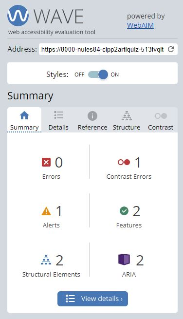
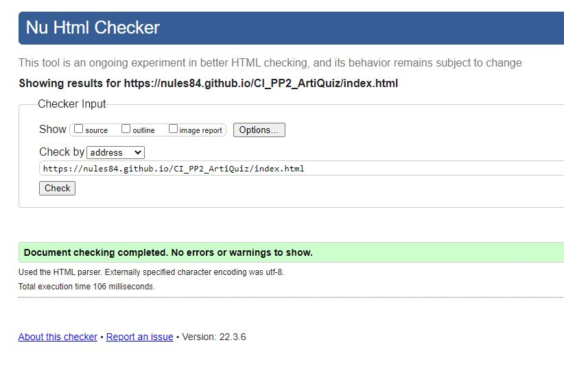
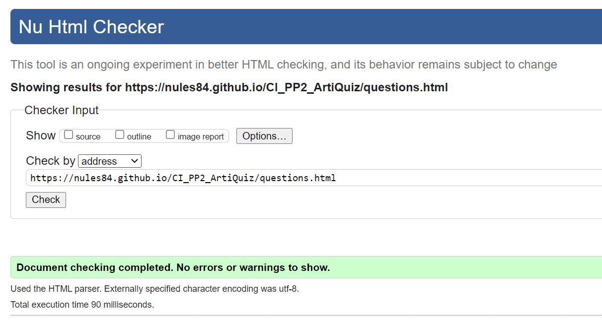
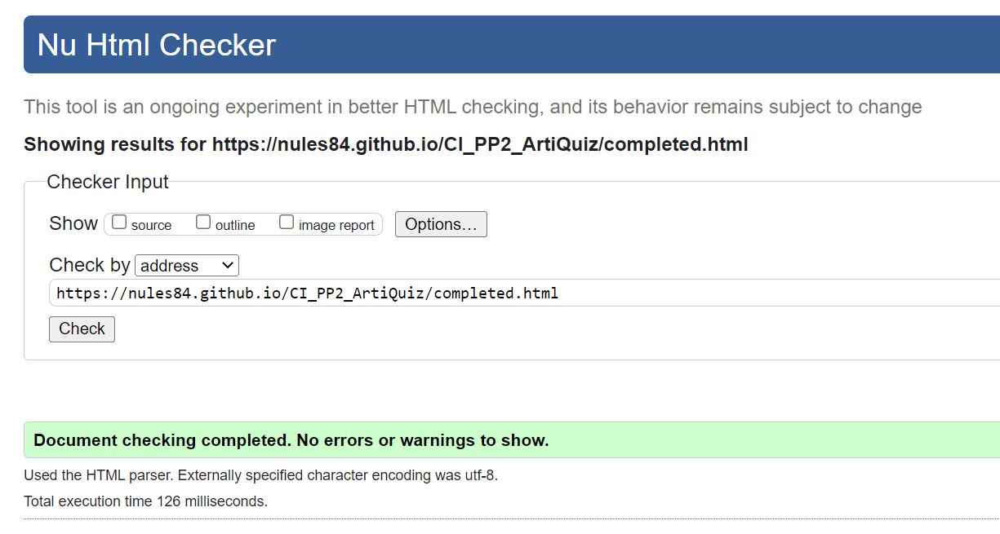
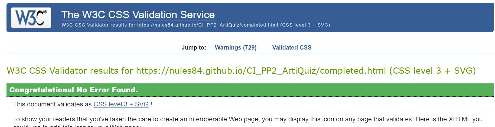
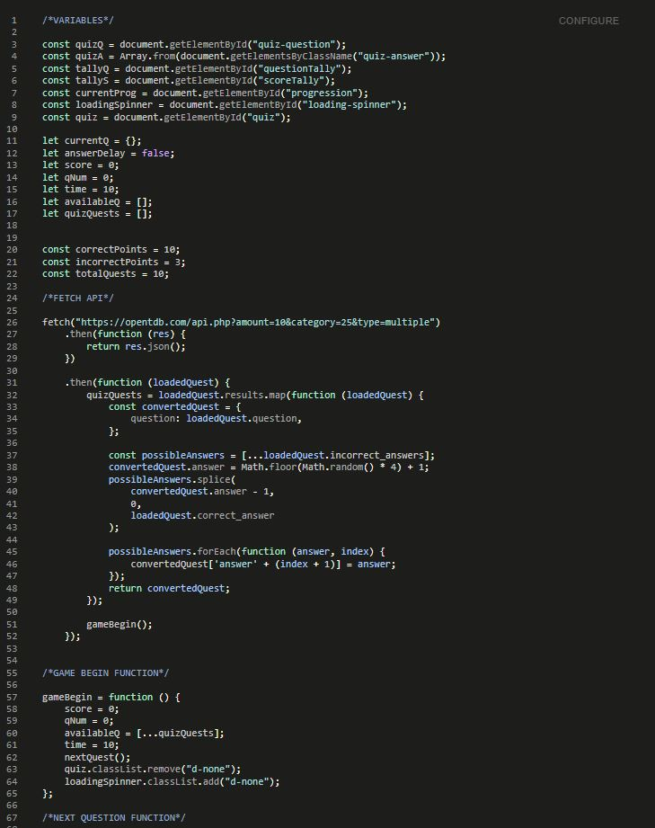
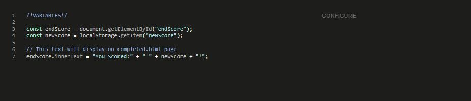

# Artiquiz
<a name="top">Developer: Nuala Gallagher King</a>

[View deployed site here](https://nules84.github.io/CI_PP2_ArtiQuiz/index.html)

ArtiQuiz is a fun, exciting, Art-based quiz game. The ArtiQuiz website's main goal is to provide the user with a pleasurable experience,
one that's memorable and has great replay value. ArtiQuiz is also intended to teach and educate users. It is hoped that people will walk away feeling
like they've learnt something. ArtiQuiz is aimed at both adults and children alike.

The idea for ArtiQuiz first originated from a group of friends gathering together every weekend to compete in a quiz night, hosted over [Zoom](https://zoom.us/),
during the Covid-19 lockdown. Each weekend, someone would create their own quiz, and each friend would battle it out to try and win the chance to host the next quiz.
ArtiQuiz was created with this in mind; for friends and family to gather together and have fun during tough times.

---

## **TABLE OF CONTENTS**

1. [UX](#ux)
    * [User Stories](#stories)
    * [Strategy](#strategy)
    * [Scope](#scope)
    * [Structure](#structure)
    * [Surface](#surface)

2. [Existing Features](#existing)
    * [Navigation](#navigation)
    * [Home](#home)
    * [Questions](#questions)
    * [Completed](#completed)
    * [Other Features](#other-feat)

3. [Features left to Implement](#features-left)

4. [Technologies](#technologies)

5. [Testing](#testing)
    * [Accessibility](#accessibility)
    * [HTML Validation](#html-validation)
    * [CSS Validation](#css-validation)
    * [Javascript Validation](#js-validation)
    * [User Story Testing](#use-stories)
    * [Bugs Testing](#bugs)

6. [Deployment](#deployment)
    * [Configure Github Pages](#pages)
    * [Cloning Repository](#cloning)

7. [Credits](#credits)
    * [Content](#content)
    * [Media](#media)
    * [Acknowledgements](#thanks)

---

## **UX** 

The user experience (UX) is what a user of a particular product experiences when using that product. A UX designer's job is thus to create a product that 
provides the best possible user experience. We're going to provide some insight into the UX process here, focusing on the important Who, What and How?

ArtiQuiz, as previously stated, is a general knowledge-based quiz game that's sole purpose is to not only provide a fun, exciting, memorable experience for
users, but to teach the user more about the Arts*. The hope is that people can walk away feeling like they've learnt something new. 
Do you have what it takes?
Carry on below and read some of ArtiQuiz's user stories to get a feel for what people have been saying about ArtiQuiz.

---

### **USER STORIES** 

>   Bright attractive colours are needed. My favourite artist is Andy Warhol for those fun pink and aquamarine pops!. - Lindsay W

>   Need an attractive logo which really captures the eye. - Diane W

>   I want to test test my Art knowledge in a fun way. - Elliot R

>   Randomly generated questions/answers are a must have! - Abi C

>   A progress bar should be included to give people a visualisation of their progress. - Laurie D

>   Definitely need a timer to be included so that players have a sense of urgency. - Lindsay W

>   Need a visual way to keep track of what question you're on and what score you have. - Heather P

>   I should be able to return to home or begin again at any stage throughout the game. - Phil W

>   Easy navigation within the website is a must. Have to make it user friendly. - Becky D

---

### **STRATEGY** 

The strategy of the ArtiQuiz website is to entertain and educate users. Our long term ambition is that ArtiQuiz hopes to move into an e-commerce situation 
where the product is licenced and the product is part of an expanded range. ArtiQuiz hopes to have multiple categories ranging from movie trivia, sports, 
history, and even geography! It is expected, that within a period, a cloud based storage system will be put in place to further improve the playability and 
replay value. Another long term strategy is that we hope to offer the public the ability to add their own questions and ultimately host our own API.

---

### **SCOPE** 

The scope of ArtiQuiz is to provide a flawless user experience straight from the get-go. We want users to be highly entertained in a socially competitive
environment whilst absorbing information they may not have encountered before. Ultimately we want users to return time and time again, not only to test their new-found knowledge, but to learn something new every time.

---

### **STRUCTURE** 

Each page will have a ArtiQuiz logo situated at the top of the screen, whether it's in the middle, or located to the left. Each page will have an identical
footer which contains copyright information and a link to the developer's LinkedIn profile. There are three pages in total, the Home page, Questions page and Completed page. The home page is fairly basic and offers only what the user needs to know. It contains ArtiQuiz's main logo image, a few lines of text, one navigation button, and a footer.

On the questions page, all questions will be displayed within one HTML page which will be randomly generated by the [Open Trivia Database](https://opentdb.com/) API. 
Each question will be navigated through via JavaScript. There are ten questions in total and there are four possible answers to each question. There is a progress bar 
located directly beneath the questions which will automatically fill as each question is answered. Below this there is a question counter, a timer and a score tally. 
These will all update automatically with the use of JavaScript as the user completes each question. Towards the bottom of the pages a there will be a "Return to Home" 
button which users can click to return to the Home page. 

The Completed page has large text indicating that the quiz has been completed. There are also a number of buttons that will navigate to the different pages of the ArtiQuizz website and return to the home page to start again if desired.

---

### **SURFACE** 

For the colour scheme, I had taken inspiration from the artist Andy Warhols print of Maralyn Monroe, using contrasting and contemporary colors. To narrow down the colours I used Adobe Color. After deciding on the colour I tested them on WAVE to make sure the contrast between them was right.
 

The images used for ArtiQuiz's logos were chosen because they relate to the theme of the website. By this, I refer to the brain image. ArtiQuiz a thinking game
therefore users must use their brains. 

 * The fonts used throughout ArtiQuiz's website is Google font's Oswald and Montserrat.

 * If at any point a browser cannot support the Oswald font, the browser will fall back on Lato.

---

## **EXISTING FEATURES** 

### **NAVIGATION** 

* All pages feature at least one navigation button. The buttons are fairly large and easily visible.

* The Questions page offers the user the ability to exit the game and return to the Home page using the "Return to Home" button. Again this button is clearly visible toward 
the bottom of the page. 

* The Completed page allows users to see their score then additionally have the coice to start the game again or navigate to the "Home" page.

* Below the "Save Score" button there are three more buttons, "Play Again"and "Return to Home". The "Play Again" button will instantly direct the user to 
a new game of ArtiQuizz. The "Return to Home" button will take 
the user back to ArtiQuiz's Home page. 

* To summarise, no matter where the user is within ArtiQuiz's website, they shouldn't have any problem navigating themselves around.
Each button has the box-shadow hover effect. This will highlight each button to make them glow gold. 

### **HOME PAGE** 

* The Home page displays a custom made ArtiQuiz logo image developed using Adobe XD. 

* The logo image features keyframes animation. The logo will increase in size from 80% to 100% over a period of four seconds.

* The Home page includes two paragraphs of text providing information to the user. This text welcomes the user and gives them slight encouragement. 

* One button is found towards the bottom of the page. This button will start the game.

* Each button has the box-shadow hover effect. Box-shadow is highly appealing to the eye and offers a better user experience. 
It essentially makes the buttons glow gold when they're interacted with.

### **QUESTIONS PAGE** 

* The Questions page displays a slightly different logo image situated to the top left-hand side of the screen. This image uses more width, rather than height, so that
little vertical screen space is taken up. Similarly, this logo image was developed using Adobe XD. 

* The first thing you should notice are the questions displayed on the Questions page. The questions themselves are displayed in a large font in gold text against a purple 
background, keeping to the theme of the ArtiQuiz website.

* Below the question, the user will be presented with four possible answers, each resembling a clickable button, much like those discovered on the Home page. When a user 
hovers their mouse over an answer button, the button will have a box-shadow effect. 

* Below the answer buttons, there is a progress bar. The progress bar is a visual interpretation of how far through the user is in their game. As a user progresses through 
the game, the progress bar will fill. There are ten questions within the ArtiQuiz game therefore the progress bar will fill ten per cent every time a question is answered. 
The progress bar has a gold border and a purple background, it fills with gold as the game progresses, keeping to the theme of the website. 

* South of the progress bar, the user is presented with three vital pieces of information.

    1. Question Counter. The question counter informs the user which question they are currently on (out of 10). This counter will increase as the game goes on.

    2. Question Timer. The timer is set to ten seconds (10), which means that each user has a maximum of ten seconds to answer any question. If a user cannot 
    answer a question in time, points will be deducted and the next question will be populated. 

    3. Score Tally. Users will be awarded ten points (10) for each correct answer but three points (3) shall be deducted for any incorrect answer although scores will not go below zero. This will be automatically updated with JavaScript code as the game is played. The point system is a key feature of the ArtiQuiz website. It enables key replay value and competitiveness. 
    
* When a question is answered, the button clicked will briefly change colour to either green or red, depending on whether the question was answered correctly or incorrectly. 
The text also changes to white momentarily. 

* Finally I shall mention that because questions are being loaded from an API, there can be a slight delay. Instead of users staring at a blank screen for any period, a loading 
spinner has been put in place. This loading spinner is a spinning circle which replaces all of the content of questions.html. It is gold in colour to match the theme of the website. 
To summarise, when a user is waiting for questions to load, the loading spinner appears. When questions are ready to be displayed, the loading spinner disappears and all of question.html's
content re-appears.

### **COMPLETED PAGE** 

* The completed page has the same logo as the Home page, situated in the middle of the page. This is to grab the user's attention. 

* The Completed page is presented to a user when they have answered all ten questions either correctly or incorrectly. During the game, as mentioned previously, a user accumulates 
points depending on whether they score a correct answer or an incorrect answer. Ten points (10) for correct, minus three (-3) for incorrect. This score is tallied up and presented to the user with a message of congratulations. 

* There is a "Return to Home" button below the congratulations message. Each button has the box-shadow hover effect.

### **OTHER FEATURES** 

 * ArtiQuiz's website has a favicon image which displays in a user's web browser tab. The image is a small green brain with a pink background.
 This favicon image keeps to the ArtiQuiz's colour theme. This has been added for improved UX.

---

## **FEATURES LEFT TO IMPLEMENT** 

 * In the future there will be different categories for a user to choose from. Currently, users are limited to one category, the arts. Soon, users will be able to choose
 from categories such as History, Sports, Geography, Nature, and many more.

 * Further down the line, we want to make it possible for users to submit their own questions for verification. These questions will then be uploaded into their own category for
 people to choose from.

 * I would also think a leaderboard would be beneficial to add to the competative and group fun aspect of the game. A function to save scores would need to be added to facilitate this in future.

 ---

## Technologies Used 

### Languages
- HTML
- CSS

### Frameworks & Tools
- Bootstrap v5.0
- Git
- GitHub
- Gitpod
- Tinypng
- Paint.NET
- Balsamiq
- Google Fonts
- Adobe Color
- Font Awsome
- Favicon.io

---

## **TESTING** 

### **Accessibility** 

Google Lighthouse in Google Chrome Developer Tools was used to test the performance of the website. 

### Home

 

### Questions

 

### Completed

 

### **HTML Validation** 

Using w3c html validator: no errors
### Home

### Questions

### Completed

### **CSS Validation** 

Using w3c Css validator: no errors

### Completed

### **Javascript Validation** 

Using the JSHint Validator: no errors

### Javascript 

#### Questions Javascript

 

#### Completed Javascript

### **User Story Testing** 

1. Bright attractive colours are needed. My favourite artist is Andy Warhol for those fun pink and aquamarine pops!. - Lindsay W

| **Feature** | **Action** | **Expected Result** | **Actual Result** |
|-------------|------------|---------------------|-------------------|
| Colors | Make a bright contemporary theme that continues throughout the quiz webite | It should be fun, simple and enticing| Works as expected |

2. Need an attractive logo which really captures the eye. - Diane W

| **Feature** | **Action** | **Expected Result** | **Actual Result** |
|-------------|------------|---------------------|-------------------|
| Home and Questions pages |Navigate to Home and Questions pages | To see the custom ArtiQuiz logo front and centre| Works as expected |

3. I want to test test my Art knowledge in a fun way. - Elliot R

| **Feature** | **Action** | **Expected Result** | **Actual Result** |
|-------------|------------|---------------------|-------------------|
| Questions | Navigate to the home page and click the play button | Start the quiz| Works as expected | 

4. Randomly generated questions/answers are a must have! - Abi C

| **Feature** | **Action** | **Expected Result** | **Actual Result** |
|-------------|------------|---------------------|-------------------|
| Questions | Navigate to the home page and click teh play button | Randomly generated questions on the topic of art | Works as expected |

5. A progress bar should be included to give people a visualisation of their progress. - Laurie D

| **Feature** | **Action** | **Expected Result** | **Actual Result** |
|-------------|------------|---------------------|-------------------|
| Questions page | Navigate to the home page and click the play button to start answering questions| A progress bar should appear and increase solidity as the game continues | Works as expected |

6.  Definitely need a timer to be included so that players have a sense of urgency. - Lindsay W

| **Feature** | **Action** | **Expected Result** | **Actual Result** |
|-------------|------------|---------------------|-------------------|
| Questions page | Navigate to the home page and click the play button to start answering questions| A timer should appear, progressing throughout the quiz| Works as expected |

7. Need a visual way to keep track of what question you're on and what score you have. - Heather P

| **Feature** | **Action** | **Expected Result** | **Actual Result** |
|-------------|------------|---------------------|-------------------|
| Questions page | Navigate to the home page and click the play button to start answering questions| Questions are numbered from 1 to 10| Works as expected |

8. I should be able to return to home or begin again at any stage throughout the game. - Phil W

| **Feature** | **Action** | **Expected Result** | **Actual Result** |
|-------------|------------|---------------------|-------------------|
| Questions and Completed page| Click Home or play again button | Once buttons are clicked you should either return home or the quiz starts again | Works as expected |

9. Easy navigation within the website is a must. Have to make it user friendly. - Becky D

| **Feature** | **Action** | **Expected Result** | **Actual Result** |
|-------------|------------|---------------------|-------------------|
| All Pages| Make teh website easy to navigate | Using large wide buttons and exciting, contemporary and a contrasting color palatte | Works as expected |

## **Bugs Testing** 

My main issue in regard to bugs was trying to add all of my Javascript to one file in the name of streamlining my work. In the end I reverted to having two separate Javascript files. The hope is that I can have them linked to the html using a single javascript file at a later date. In saying that, the site works well with the two separate Javascript files.

## **DEPLOYMENT** 

### **CONFIGURE GITHUB PAGES** 

GitHub Pages is a static site hosting service that takes HTML, CSS, and JavaScript files straight from a repository on GitHub, optionally runs the files through a build process, 
and publishes a website. ArtiQuiz's website has been successfully hosted by GitHub Pages by following these processes:

1. Navigate to the Github remote repository: 
2. Click on Settings.
3. Scroll down to the GitHub Pages section.
4. Locate Source's dropdown menu and select 'Master Branch'.
5. After a short period of time, a link will become available above. ArtiQuiz's link is:

*Please note that it can take up to 20 minutes for this process to complete.*

### **CLONING REPOSITORY** 

1. Navigate to the Github remote repository: 
2. Click green button labelled "Code" with download icon visible (next to Gitpod button).
3. Copy the clone HTTPS or SSH by clicking on the copy button.
4. Open [Git Bash](https://gitforwindows.org/).
5. Change the current working directory to the location where you want the cloned directory to be made.
6. Type git clone, and then paste the URL you copied.
7. Press Enter. Your local clone will be created.

---

## **CREDITS** 

Various websites were used for ArtiQuiz's website to become what it is today. All content displayed is part of the public domain.

### **CONTENT** 

* ArtiQuiz's logos were created and designed by [Nuala King](https://www.linkedin.com/in/nuala-g-king-ngk84/) - ArtiQuiz's Full Stack Web Developer, using [Adobe XD](https://www.adobe.com/uk/products/xd.html). Images sourced from [PNG Guru](https://www.pngguru.com/).
* Some textual content on the ArtiQuiz website was written by [Nuala King](https://www.linkedin.com/in/nuala-g-king-ngk84/) - ArtiQuiz's Full Stack Web Developer.
* Although not copied exactly, it's worth mentioning that [James Q Quick](https://www.youtube.com/channel/UC-T8W79DN6PBnzomelvqJYw) was a great help during the JavaScript coding for ArtiQuiz's website. Please see Acknowledgements below.

* Structure and inspiration -[WebSlinger88Code Institute](https://github.com/WebSlinger88/Quizzical.git)
This inspirational website was composed by WebSlinger88 which in turn was inspired by tutorials compiled by James Q Quick as mentioned in acknowlegements section.

### **MEDIA** 

* Imagery:

    * [PNG Guru](https://www.pngguru.com/)

* Text:

    * [Google Fonts](https://fonts.google.com/)
    * [Font Awesome](https://fontawesome.com/icons?d=gallery&m=free)

### **ACKNOWLEDGEMENTS** 

Inspiration was used in various locations across the world wide web. Please see below some of the key sources used to help develop ArtiQuiz.

* JavaScript - [James Q Quick - Youtube](https://www.youtube.com/channel/UC-T8W79DN6PBnzomelvqJYw) | [James Q Quick - Github](https://github.com/jamesqquick)

* James Q Quick's video tutorials were very helpful during the JavaScript coding process. The Quiz App videos were especially helpful - [Build a Quiz App](https://www.youtube.com/watch?v=u98ROZjBWy8).
    Code has not been copied exactly. There are similarities to be found. Please make note of this. James Q Quick does deserve credit.

* Timer - [Muhanad Hasan](https://www.youtube.com/channel/UC1xxTfHbYlFLzjqUIQbA7iQ)

    * Muhanad Hasan gave me the idea for my JavaScript timer - [Quiz Timer](https://www.youtube.com/watch?v=9-5URe9CykA).

* API Questions - [Open Trivia Database](https://opentdb.com/)

    * Thanks to everyone at Open Trivia Database for providing such quality questions for free!  

* CSS Loader - [w3schools](https://www.w3schools.com/howto/howto_css_loader.asp)

    * Thanks to w3schools for again providing solid information. Always a go-to site!

---
*A special thank you to Chris Quinn, Code Institute Mentor, for aid, assistance, and much-needed guidance!* 

---
[:arrow_up: Return to top?](#top)
